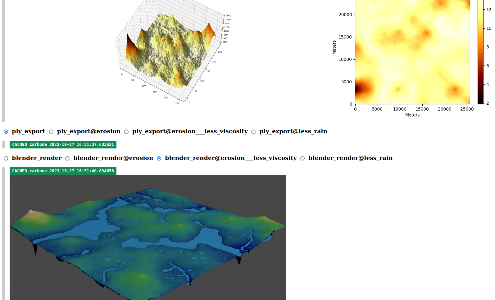
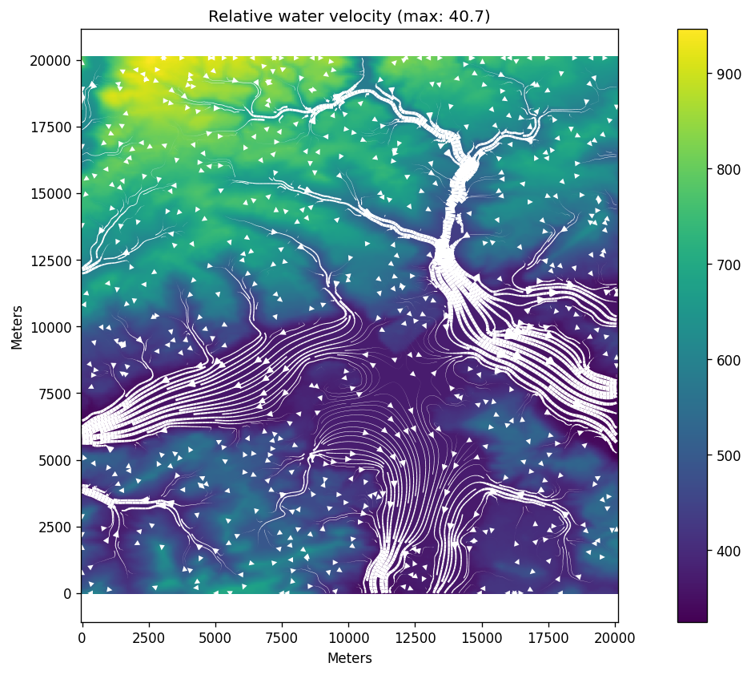

## prerequisites

- Python 3.recent
- packages listed in requirements.txt
- Blender in PATH
- `pango-view` in PATH; usually provided by 'pango' package

then you can execute `./worldmaker.py world_defs/new2021.yml`



## how it works

- a [YAML file with pipeline definition](world_defs/new2021.yml) is parsed ("operations" and their parameters)
- a Makefile and some other files are generated
- make is executed to process the pipeline

there are some specifics/advantages over other approaches including plain Make:

- high abstraction of operator set-up
	- operators can generate additional outputs
	- generating variants via "options overlays" (Drake has something similar called [Static branching](https://books.ropensci.org/drake/static.html))
	- implicit inputs/output for operators (arguably bad)
- automatic generation of HTML file to visualize the results
- automatic logging per task
- persistent cache (based on hash of recipe + inputs, per each instantiated operator)

### btw

- the pipeline contains certain [default steps](pipeline_world.py#844).
  at some point that turned out to be a bad idea -- warnings are now emitted for this.
- plotting steps are usually separate from the computation itself, because matplotlib is _slow_
  and in the meantime, the outputs can be used by subsequent steps
    - plotting step can be emitted by the computation step, see the example in [GeoStep](pipeline_world.py#L26)
- blender rendering takes forever, surely there must be a better way (there's a package called _pyrender_...)
- the code is mostly experimental and very messy

here is an example of a generated descriptor, used mainly to enable caching:

```json
{
  "viscosity": 0.1,
  "rainfall": 0.01,
  "max_iters": 100000,
  "__operator": "world.hydro_sim:3",
  "__inputs": {
    "terrain.h5": "work/aa_new2021/terrain.h5"
  },
  "__outputs": {
    "water.h5": "work/aa_new2021/water.h5",
    "water_sim_convergence.png": "work/aa_new2021/water_sim_convergence.png"
  }
}
```

the outputs are .tar.xz'd together with a version of this file where input paths are replaced with content hashes.

### résumé

Some 2.5 years later, I still think the general approach was sound.
Sure, it suffers from the fact that YML makes for a shoddy DSL -- back then I hadn't had my LISP epiphany yet.
And the implemented operators just aren't very good.

It would be cool to see if there is a project doing the same thing, better. I searched around, but didn't find one. Snakemake came pretty close.

It would be useful if the generated steps could be submitted to some kind of job server. Many of those exist but I don't have a specific one in mind.


